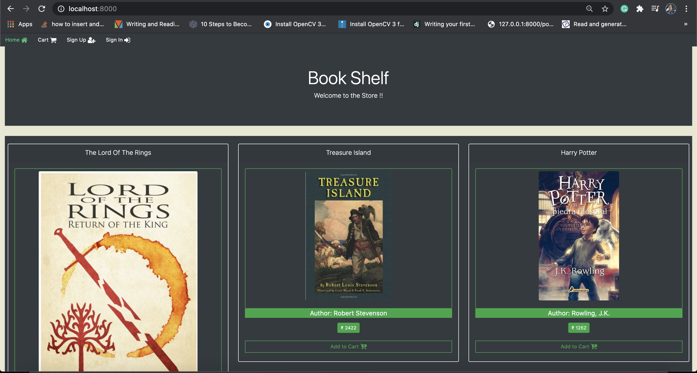

## Setup

#### npm i && npm start

#### to view in browser visit http://localhost:8000/

--------------------------------------------------------
##### Book Shelf is a online book store application where you can buy your favourite books.

--------------------------------------------------------

##### SignUp in the application....

--------------------------------------------------------

##### Go to signin page...

--------------------------------------------------------

##### if you are an admin you can able to view admin dashboard now

--------------------------------------------------------

##### admin is now able to manage products from here

--------------------------------------------------------

##### after user login into application, can add products into cart and click on buy now for payment and checkout process.

